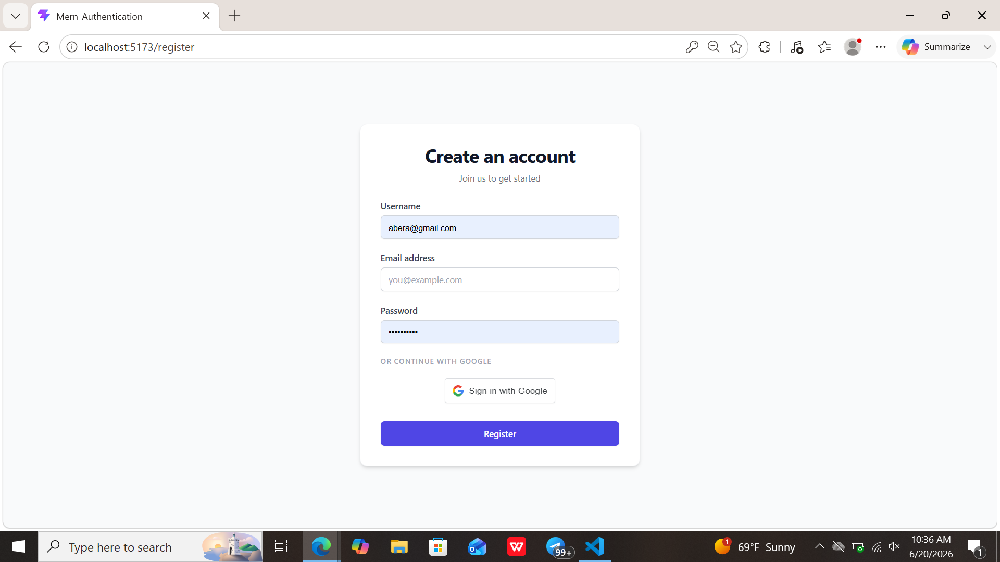
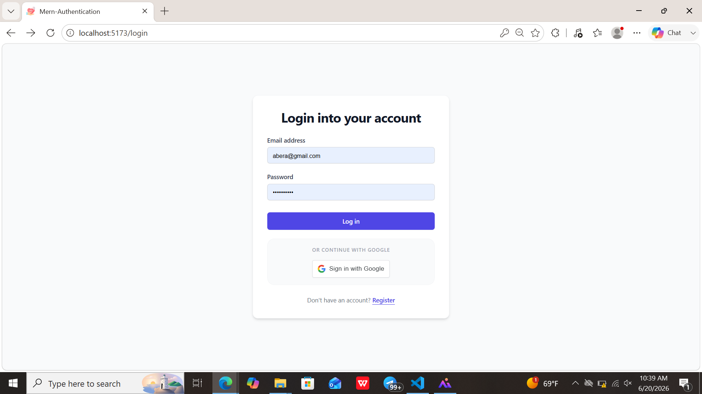
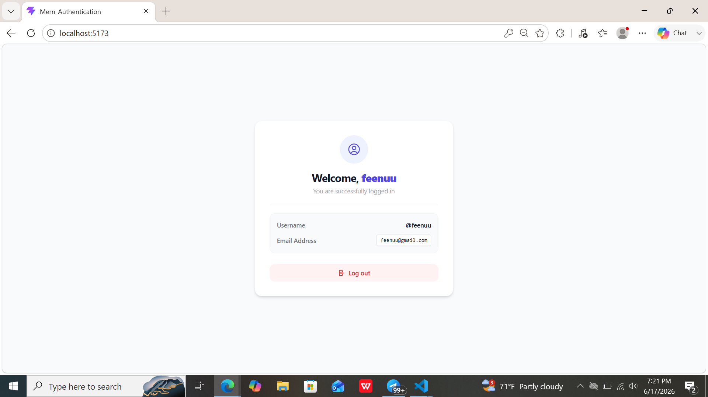

# MERN Stack Authentication System

A full-featured authentication system built with the **MERN Stack** (MongoDB, Express.js, React.js, and Node.js). The application supports both **traditional email/password authentication** and **Google OAuth authentication**, providing secure access to a protected user dashboard.

---

## 📸 Application Screenshots

### 1. Register Page



### 2. Login Page



### 3. User Dashboard



---

## 🚀 Features

### Authentication

* **User Registration** using email and password.
* **User Login** with email and password.
* **Google Sign-Up** using Google OAuth.
* **Google Login** using Google OAuth.
* **JWT Authentication** for secure and stateless user sessions.
* **Automatic Account Creation** for new Google users.

### Security

* Password hashing using **bcryptjs**.
* JWT-based route protection.
* Secure authentication middleware.
* Environment variables for sensitive credentials.

### User Experience

* Protected dashboard accessible only to authenticated users.
* Displays authenticated user's profile information.
* Persistent login using stored authentication tokens.
* Responsive UI built with Tailwind CSS.

---

## 🛠️ Tech Stack

### Backend

* Node.js
* Express.js
* MongoDB
* Mongoose
* jsonwebtoken (JWT)
* bcryptjs
* cors
* dotenv

### Frontend

* React.js
* React Router
* Axios
* Tailwind CSS
* Google OAuth for React

---

## ⚙️ Environment Variables

Create a `.env` file inside the `backend` directory:

```env
PORT=5000
MONGO_URI=your_mongodb_connection_string
JWT_SECRET=your_super_secret_jwt_key
GOOGLE_CLIENT_ID=your_google_client_id
```

---

## 🚀 Installation & Setup

### 1. Clone the Repository

```bash
git clone <repository-url>
cd mern-auth-app
```

### 2. Backend Setup

```bash
cd backend

npm install express mongoose bcryptjs jsonwebtoken cors dotenv

npm run dev
```

### 3. Frontend Setup

```bash
cd frontend

npm install
npm install react-router-dom axios
npm install @react-oauth/google
npm install -D tailwindcss postcss autoprefixer

npm run dev
```

---

## 📁 Project Structure

```text
mern-auth-app/
├── backend/
│   ├── config/              # Database configuration
│   ├── controllers/         # Authentication controllers
│   ├── middleware/          # JWT authentication middleware
│   ├── models/              # Mongoose schemas
│   ├── routes/              # API routes
│   ├── .env                 # Environment variables
│   └── server.js            # Backend entry point
│
└── frontend/
    ├── src/
    │   ├── pages/           # Login, Register, Dashboard pages
    │   ├── components/      # Reusable UI components
    │   ├── App.jsx          # Route configuration
    │   └── main.jsx         # Application entry point
```

---

## 🔐 Authentication Flow

### Email & Password Authentication

1. User registers with name, email, and password.
2. Password is hashed using bcryptjs before storage.
3. User logs in with credentials.
4. Server generates a JWT token.
5. Protected routes validate the token before granting access.

### Google Authentication

1. User clicks **Continue with Google**.
2. Google verifies the user's identity.
3. Frontend sends the Google credential token to the backend.
4. Backend validates the token.
5. A new account is created automatically if the user does not exist.
6. JWT token is generated and returned to the frontend.
7. User is redirected to the protected dashboard.

---

## 🎯 Future Improvements

* Email verification
* Password reset functionality
* Refresh tokens
* Role-based authorization
* Profile picture uploads
* Two-factor authentication (2FA)

---

## 📜 License

This project is open-source and available under the MIT License.
